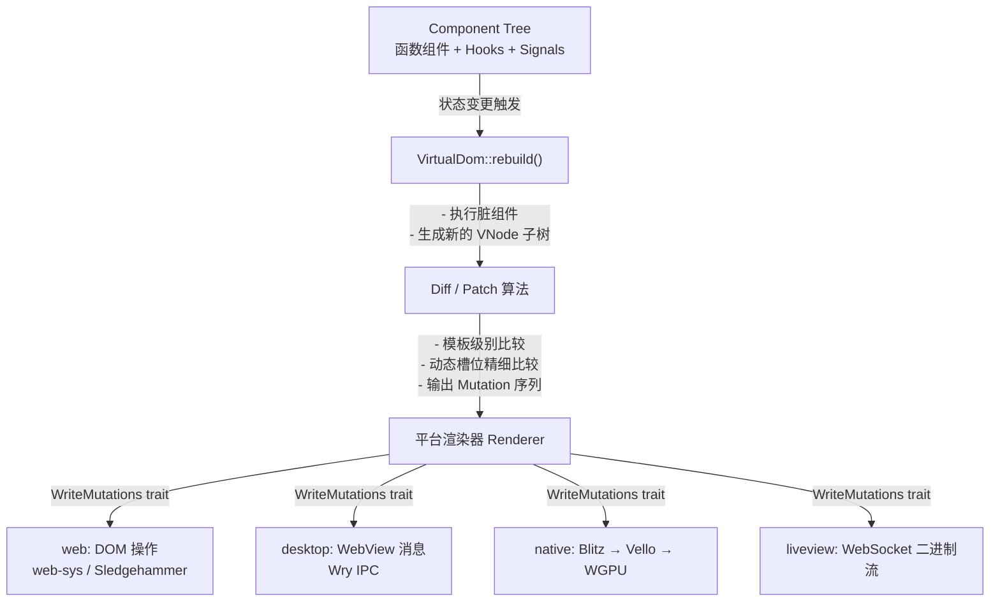
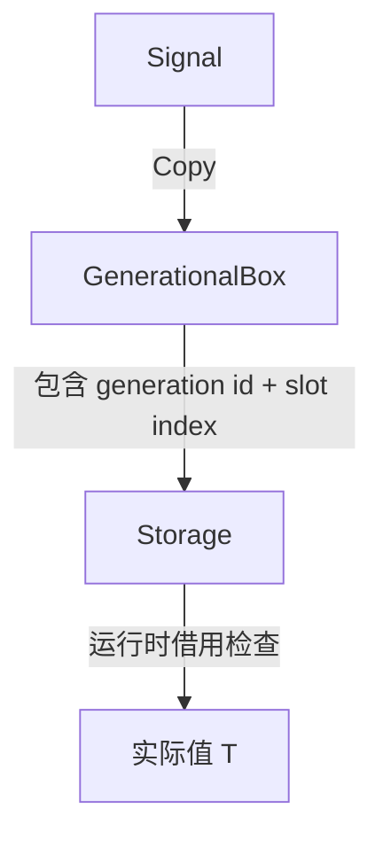
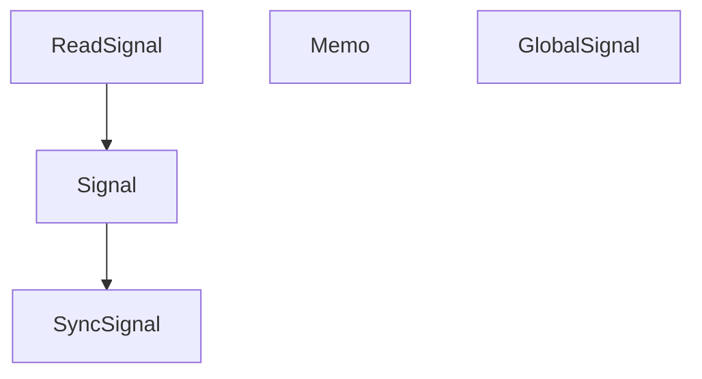
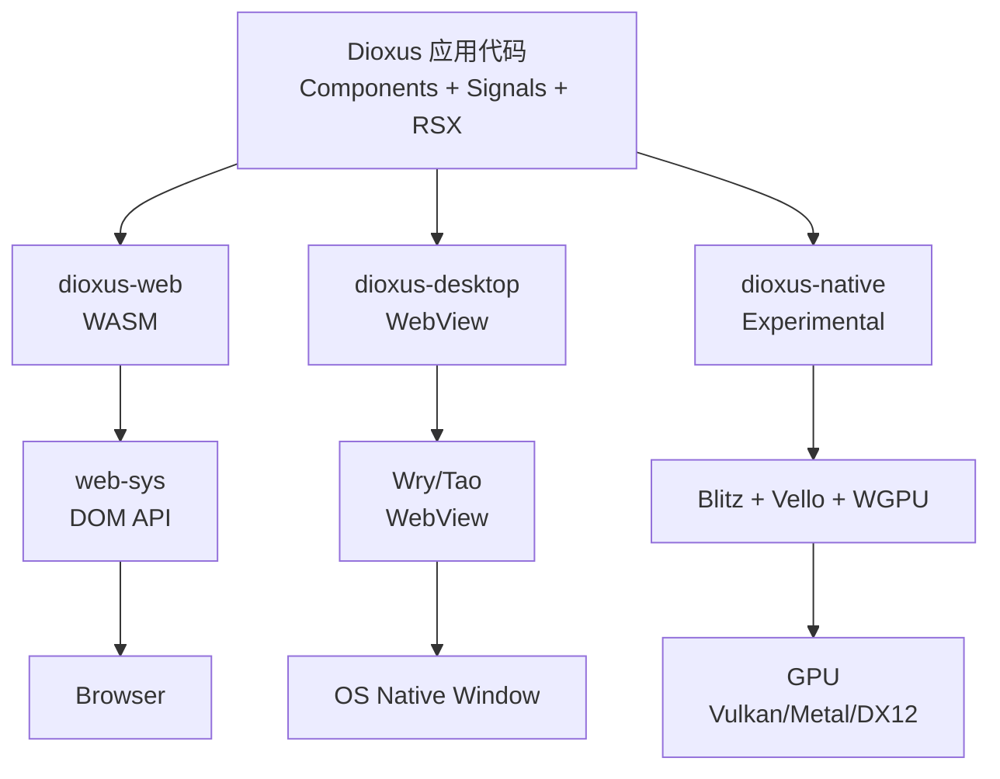
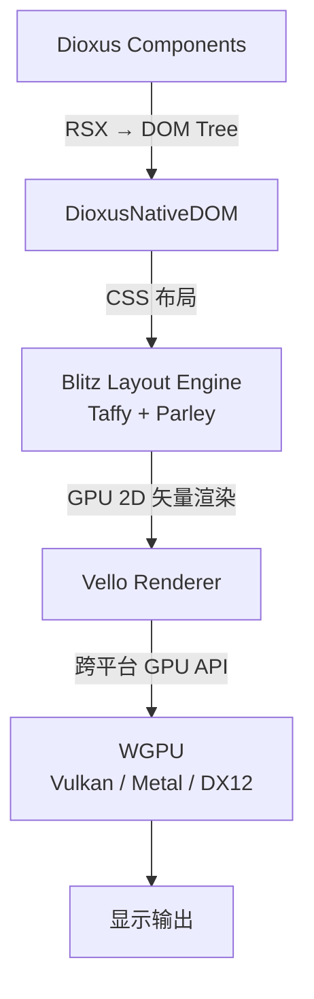
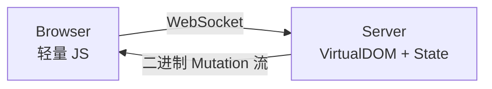
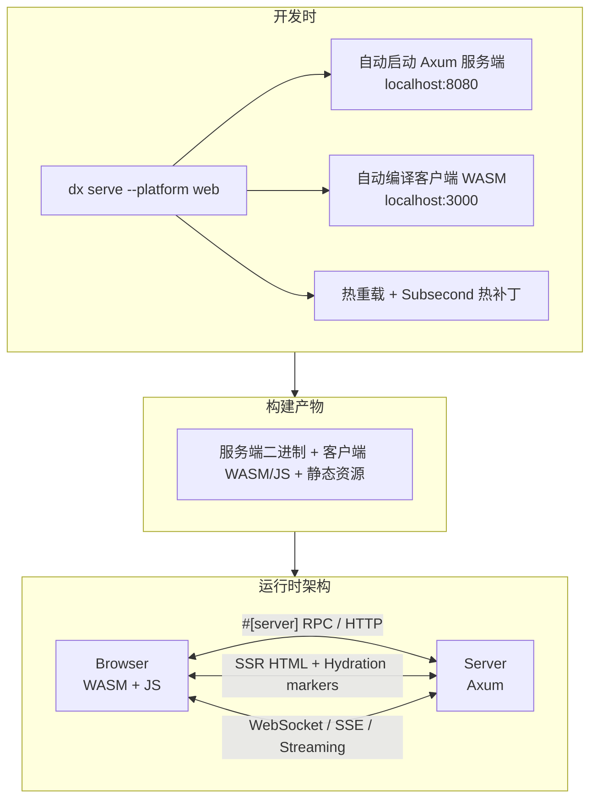
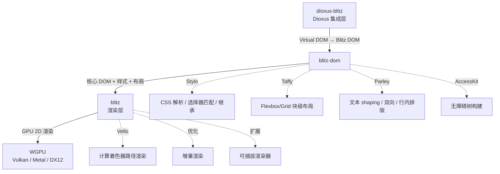
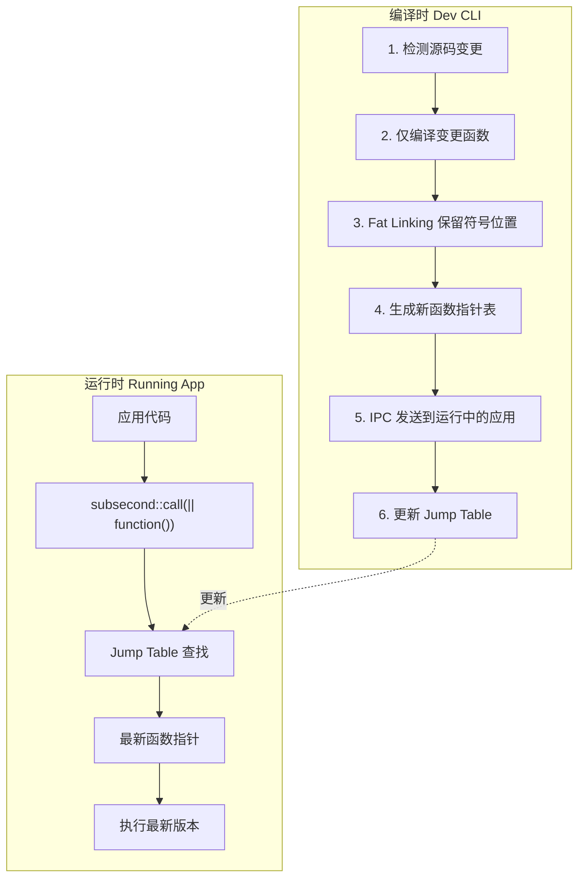
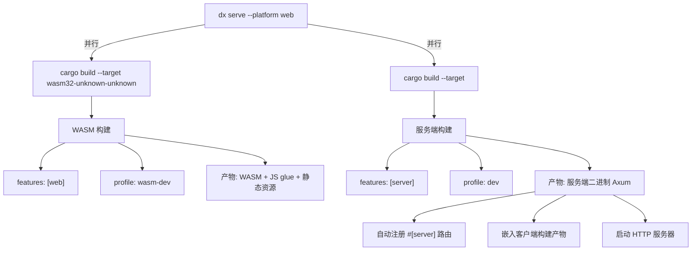

# Dioxus 0.7.10 架构设计全面分析

> 本文档基于 Dioxus 0.7.x 系列（截至 0.7.10）的公开技术资料、源码结构、Release Notes 及社区实践整理而成，涵盖框架的整体架构、核心子系统、渲染层、全栈能力及开发工具链。

---

## 目录

1. [概述](#1-概述)
2. [Workspace 与包结构](#2-workspace-与包结构)
3. [核心运行时：Virtual DOM 与组件系统](#3-核心运行时virtual-dom-与组件系统)
4. [响应式系统：Signals、Stores 与 Hooks](#4-响应式系统signalsstores-与-hooks)
5. [RSX 宏与模板系统](#5-rsx-宏与模板系统)
6. [多平台渲染器架构](#6-多平台渲染器架构)
7. [全栈架构：Server Functions、SSR 与 Hydration](#7-全栈架构server-functionsssr-与-hydration)
8. [Blitz 原生渲染引擎](#8-blitz-原生渲染引擎)
9. [Subsecond 热补丁系统](#9-subsecond-热补丁系统)
10. [CLI 与构建工具链](#10-cli-与构建工具链)
11. [0.7.10 版本特定变更](#11-0710-版本特定变更)
12. [架构设计哲学与权衡](#12-架构设计哲学与权衡)

---

## 1. 概述

Dioxus 是一个基于 Rust 的跨平台 UI 框架，设计目标是用单一 Rust 代码库构建 Web、桌面、移动端、服务端乃至嵌入式平台的应用。0.7 版本是 Dioxus 的重大里程碑，引入了多项架构级革新：

- **Signals 驱动的细粒度响应式系统**（取代传统 Virtual DOM 的粗粒度重渲染）
- **全栈一体化**：内置类型安全的 Server Functions、SSR、Hydration，深度集成 Axum
- **多渲染器策略**：Web (WASM/DOM)、桌面 (WebView)、原生 (WGPU/Blitz)、LiveView (WebSocket)
- **Subsecond 热补丁**：运行时 Rust 代码热替换，无需重启进程
- **Stores API**：嵌套结构的响应式状态管理原语

---

## 2. Workspace 与包结构

Dioxus 采用大型 Cargo Workspace 组织，核心 crate 位于 `packages/` 目录下：

```
dioxus/
├── packages/
│   ├── dioxus/              # 主入口 crate，聚合重导出所有公共 API
│   ├── core/                # Virtual DOM、组件生命周期、调度器、diff 算法
│   ├── signals/             # Signal、Memo、Store 等响应式原语
│   ├── hooks/               # 内置 Hooks（use_signal, use_effect 等）
│   ├── rsx/                 # RSX 宏解析与代码生成
│   ├── rsx-hotreload/       # RSX 模板热重载的 diff 与补丁逻辑
│   ├── router/              # 类型安全路由（#[derive(Routable)]）
│   ├── fullstack/           # SSR、Hydration、Server Functions 全栈运行时
│   ├── server/              # 服务端运行时与 Axum 集成
│   ├── web/                 # Web 平台渲染器（WASM → DOM）
│   ├── desktop/             # 桌面平台渲染器（Wry/Tao WebView）
│   ├── native/              # 原生 GPU 渲染器（Blitz/Vello/WGPU）
│   ├── liveview/            # LiveView 模式（服务端状态 + WebSocket 流式更新）
│   ├── ssr/                 # 服务端渲染引擎
│   ├── document/            # 文档/head 管理（SEO、元标签）
│   ├── history/             # 导航历史抽象
│   ├── html/                # HTML 元素定义与事件类型
│   ├── interpreter-js/      # Sledgehammer：用于 DOM 变更的 JS 解释器/绑定层
│   ├── subsecond/           # 热补丁运行时（jump table 间接调用）
│   ├── devtools/            # 开发工具协议与调试通信
│   ├── devtools-types/      # 开发工具类型定义
│   ├── cli/                 # dx 命令行工具（构建、serve、bundle）
│   ├── cli-opt/             # CLI 配置与选项解析
│   ├── cli-config/          # 跨 crate 共享的 CLI 配置
│   ├── asset-resolver/      # 资源解析与路径处理
│   ├── manganis/            # asset!() 宏：编译期资源嵌入
│   ├── wasm-split/          # WASM 代码分割与懒加载
│   └── generational-box/    # Signal 底层存储：基于世代的轻量 GC 盒子
```

### 关键依赖关系

- `dioxus` 是 facade crate，依赖并重导出 `dioxus-core`、`dioxus-signals`、`dioxus-hooks`、`dioxus-router` 等
- `dioxus-signals` 依赖 `generational-box`（零 unsafe 的世代内存管理）和 `dioxus-core`
- 各渲染器（web/desktop/native/liveview）均依赖 `dioxus-core`，实现各自的 `WriteMutations` trait
- `dioxus-fullstack` 依赖 `dioxus-server` 和 `dioxus-ssr`，并桥接客户端与服务端

---

## 3. 核心运行时：Virtual DOM 与组件系统

### 3.1 组件模型

Dioxus 采用**函数组件**模型，类似 React：

```rust
#[component]
fn Counter() -> Element {
    let mut count = use_signal(|| 0);
    rsx! {
        button { onclick: move |_| count += 1, "Count: {count}" }
    }
}
```

- 组件是普通的 Rust 函数，返回 `Element`（即 `VNode` 树）
- 无类组件，无生命周期方法，状态与副作用完全通过 Hooks 管理
- 0.5+ 版本后组件为**静态组件**（无 `Scope`/`cx` 参数），配合 `Copy` 的 Signal 大幅简化状态传递

### 3.2 Virtual DOM

Dioxus 内部维护一棵 `VNode`（Virtual Node）树：

- **模板节点（Template Nodes）**：RSX 宏在编译期将静态结构提取为模板，运行时只需克隆模板句柄，避免重复分配
- **动态节点（Dynamic Nodes）**：文本插值、条件渲染、列表渲染等动态内容挂载在模板的"占位槽"中
- **动态属性（Dynamic Attributes）**：类似地，变化的属性也走独立路径

这种**模板化 VDOM** 设计显著降低了 diff 开销：静态部分在编译期确定，运行时 diff 只需关注动态槽位。

### 3.3 调度与渲染循环



### 3.4 事件系统

- 事件在渲染器层捕获，通过 `dioxus-html` 定义的类型安全事件枚举传递到 Virtual DOM
- 事件处理器是普通的 Rust 闭包，可直接修改 Signal，触发重新渲染
- 支持事件冒泡与捕获模型

---

## 4. 响应式系统：Signals、Stores 与 Hooks

### 4.1 Signals 架构

Signals 是 Dioxus 0.5+ 引入的核心状态原语，0.7 进一步完善为主要的响应式机制。

#### 核心特性

| 特性 | 说明 |
|------|------|
| `Copy` | `Signal<T>` 总是 `Copy`，即使 `T` 不是。通过 `generational-box` 的间接引用实现 |
| 自动订阅 | 组件在渲染时读取 Signal 即自动建立订阅，无需手动注册 |
| 细粒度更新 | Signal 变更只触发依赖它的组件/效果重新执行，而非整棵树 |
| 线程安全 | `SyncSignal<T>` 支持 `Send + Sync`，可跨线程传递 |

#### generational-box 机制



- `generational-box` 实现了一个轻量的、基于世代的"垃圾回收"机制
- Signal 的生命周期与创建它的组件作用域绑定：组件卸载时，其分配的 generational slots 被回收
- 零 unsafe 代码实现，依赖运行时借用检查（`try_read`/`try_write`）

#### Signal 类型层次



### 4.2 Stores API（0.7 新增）

Stores 用于处理**嵌套结构的响应式状态**，解决 Signal 在复杂嵌套数据（如 `BTreeMap<String, Dir>`）中难以精准追踪字段变更的问题。

```rust
#[derive(Store)]
struct Dir {
    children: BTreeMap<String, Dir>,
}

// 精准订阅特定字段，而非整个结构
let mut children: Store<Vec<Dir>, _> = directory.children();
```

- 通过 `#[derive(Store)]` 宏自动生成字段级别的响应式访问器
- 支持深层路径订阅（`store.field.nested_field()`）
- 底层仍基于 `generational-box` 和 Signal 机制

### 4.3 Hooks 系统

Dioxus 提供丰富的内置 Hooks：

| Hook | 用途 |
|------|------|
| `use_signal` / `use_signal_sync` | 创建响应式状态 |
| `use_state` | 不可变状态更新（旧 API，Signal 优先） |
| `use_effect` | 副作用（依赖变更时执行） |
| `use_memo` | 缓存昂贵计算 |
| `use_context` / `use_provider` | 跨组件依赖注入 |
| `use_resource` / `use_server_future` | 异步数据获取 |
| `use_router` | 路由导航与参数访问 |
| `use_websocket` | WebSocket 连接（0.7 新增） |

Hooks 遵循 React 的 Rules of Hooks：必须在组件顶层按固定顺序调用。

---

## 5. RSX 宏与模板系统

### 5.1 RSX 语法

RSX（Rust Syntax Extension）是 Dioxus 的 JSX-like 宏：

```rust
rsx! {
    div {
        class: "container",
        h1 { "Hello {name}" }
        if show_list {
            ul {
                for item in items {
                    li { key: "{item.id}", "{item.name}" }
                }
            }
        }
    }
}
```

### 5.2 编译期优化

RSX 宏在编译期执行以下转换：

1. **模板提取**：将静态 HTML-like 结构提取为 `Template` 常量，运行时直接引用
2. **动态槽标记**：将 `{expression}` 插值、条件、循环标记为动态节点/属性槽位
3. **Key 生成**：为列表项自动或手动分配 `key`，用于高效 diff
4. **事件闭包捕获**：将事件处理器转换为可序列化的回调标识（跨平台需要）

### 5.3 热重载支持

`rsx-hotreload` crate 在开发模式下：
- 监听 RSX 模板的源码变更
- 计算模板 AST 的差异
- 通过 WebSocket 将模板补丁发送到运行中的应用
- 浏览器/桌面端即时应用新模板，无需重新编译 Rust 代码

---

## 6. 多平台渲染器架构

Dioxus 的核心设计哲学是**"一次编写，到处渲染"**，通过统一的 `WriteMutations` trait 抽象不同平台的 DOM/渲染操作。

### 6.1 渲染器总览



### 6.2 dioxus-web（Web 平台）

- **目标**：编译为 `wasm32-unknown-unknown`，在浏览器中运行
- **DOM 操作**：
  - 主要使用 `web-sys` 绑定调用浏览器 DOM API
  - 通过 `dioxus-interpreter-js`（Sledgehammer）使用高效的二进制协议批量传输 DOM 变更，减少 JS/Rust 边界跨越开销
- **包大小**：约 60KB gzipped（仅框架运行时）
- ** Hydration**：支持从 SSR 渲染的 HTML 恢复交互状态

### 6.3 dioxus-desktop（桌面平台）

- **目标**：Windows、macOS、Linux 原生桌面应用
- **技术栈**：
  - **Tao**：跨平台窗口管理（Winit 的分支，扩展了系统托盘、全局快捷键等）
  - **Wry**：基于系统 WebView 的渲染引擎（Windows: WebView2, macOS: WKWebView, Linux: WebKitGTK）
  - **IPC**：Rust 后端与 WebView 前端通过自定义协议和消息通道通信
- **特点**：
  - 单二进制文件分发
  - 可访问原生 API（文件对话框、系统通知、剪贴板等）
  - 支持透明窗口、全屏、自定义标题栏等

### 6.4 dioxus-native（实验性原生渲染）

- **目标**：无需 WebView，直接 GPU 渲染原生 UI
- **渲染管线**：



- **技术组件**：
  - **Stylo**：Firefox/Servo 的 CSS 解析与样式计算引擎
  - **Taffy**：Flexbox/Grid 块级布局引擎
  - **Parley**：文本 shaping、双向布局、行内排版
  - **Vello**：基于计算着色器的 GPU 2D 渲染器（Google Linebender 项目）
  - **AccessKit**：无障碍支持
  - **Winit**：窗口与输入管理
- **状态**：实验阶段，0.7 中大幅改进，支持增量渲染、自定义元素等

### 6.5 dioxus-liveview（服务端渲染模式）



- 所有应用状态与 Virtual DOM 运行在服务端
- 通过 WebSocket 向客户端流式传输二进制 DOM 变更指令
- 客户端仅需极少量 JavaScript（Sledgehammer 解释器）应用变更
- 适合高安全要求或低客户端算力场景

### 6.6 dioxus-ssr（服务端渲染）

- 将 Virtual DOM 渲染为静态 HTML 字符串
- 支持 hydration marker 注入，供客户端 hydrate 恢复
- 用于 SEO、首屏加速、静态站点生成（SSG）

---

## 7. 全栈架构：Server Functions、SSR 与 Hydration

### 7.1 架构概览

Dioxus 0.7 的全栈能力是其最大差异化特性之一，提供**类型安全的前后端一体化开发体验**。



### 7.2 Server Functions

`#[server]` 宏是 Dioxus 全栈的核心抽象：

```rust
#[server(endpoint = "/api/fortune")]
async fn fetch_fortune() -> Result<String, ServerFnError> {
    // 这段代码只在服务端编译执行
    Ok("Dioxus is super productive!".to_string())
}
```

**宏展开机制**：
1. **服务端编译**（`feature = "server"`）：生成 Axum 路由处理器，注册到服务端路由器
2. **客户端编译**（`feature = "web"`）：生成 HTTP 客户端存根，调用时自动序列化参数并发送 POST 请求
3. **类型安全**：参数与返回值通过 serde 序列化，编译期保证类型一致

**0.7 新增能力**：
- `#[get("/api/route")]` / `#[post("/api/:path")]` 等 RESTful 路由宏
- 纯 Axum handler 支持（`FromRequest` / `IntoResponse`）
- 服务端专属 Extractor（访问 `axum::extract::Request`、数据库连接池等）
- `HttpError` 类型与自定义错误响应
- `anyhow::Error` 支持作为返回值
- `Streaming<T, E>` 流式响应
- `Websocket` 类型与 `use_websocket` Hook
- `MultipartFormData` 跨平台文件上传
- `Lazy<T>` 懒加载初始化器

### 7.3 SSR 与 Hydration

```rust
fn main() {
    // 自动处理：服务端渲染 HTML → 浏览器加载 → 客户端 Hydrate
    dioxus::launch(App);
}
```

**流程**：
1. 服务端使用 `dioxus_ssr::Renderer` 将 `VirtualDom` 渲染为 HTML 字符串
2. 注入 hydration marker（`data-dioxus-id` 等属性）标记动态节点位置
3. 浏览器接收 HTML 并显示首屏
4. WASM 加载完成后，客户端创建 `VirtualDom` 并与现有 DOM 对齐（hydrate）
5. 事件监听器绑定，应用变为完全交互式

**手动 SSR**：
```rust
let mut vdom = VirtualDom::new(app);
vdom.rebuild_in_place();
let mut renderer = Renderer::new();
renderer.pre_render = true; // 启用 hydration markers
let html = renderer.render(&vdom);
```

### 7.4 依赖管理

全栈项目通过 Cargo features 分离服务端/客户端依赖：

```toml
[dependencies]
dioxus = { version = "0.7", features = ["web", "fullstack"] }
serde = { version = "1.0", features = ["derive"] }

[features]
default = []
server = ["dioxus/server"]
```

- `sqlx`、`chrono` 等仅服务端需要的依赖应 feature-gate 在 `server` 后
- `SyncSignal<T>` 提供跨服务端/客户端的内部可变性

---

## 8. Blitz 原生渲染引擎

Blitz 是 Dioxus 团队开发的模块化 HTML/CSS 渲染器，为 `dioxus-native` 提供底层渲染能力，也可独立使用。

### 8.1 架构分层



### 8.2 设计目标

- **轻量**：目标二进制大小约 12MB（对比 Electron ~130MB、Servo ~98MB）
- **模块化**：可选编译视频、图像格式、SVG、布局算法等模块
- **生态优先**：复用 Servo、Linebender 等成熟 Rust 生态组件，双向贡献
- **应用 UI 导向**：专注应用界面渲染，不追求完整浏览器兼容性（不支持 WebRTC、复杂 JS 等）

### 8.3 与 Dioxus 的集成

- `dioxus-native` crate 将 Dioxus 组件树转换为 Blitz DOM 树
- 支持 Dioxus 的完整交互模型（事件、Signal 更新、动画）
- 0.8 方向：增量渲染、自定义元素、更完整的 CSS 支持

---

## 9. Subsecond 热补丁系统

Subsecond 是 Dioxus 0.7 引入的实验性 Rust 代码热补丁引擎，解决 Rust 开发中"修改→编译→重启"的慢反馈循环问题。

### 9.1 工作原理



### 9.2 技术细节

- **Jump Table 间接调用**：Subsecond 不修改进程内存（避免传统 detour/patch 的不安全性），而是在编译期将所有 `subsecond::call()` 包装为通过跳转表间接调用
- **Fat Linking**：启动时执行的特殊链接模式，保留所有符号的固定地址，使后续补丁可安全引用
- **安全回退**：若补丁应用失败， stale 的 `call` 会触发安全 panic，被上层自动捕获并重试
- **仅 Debug**：`debug_assertions` 启用时生效，生产构建无性能开销

### 9.3 使用方式

```bash
# 启用热补丁模式
dx serve --hotpatch
```

```rust
// 应用代码中标记可热补丁的函数
pub fn launch() {
    loop {
        std::thread::sleep(Duration::from_secs(1));
        subsecond::call(|| tick()); // 修改 tick() 后自动生效
    }
}
```

### 9.4 与 RSX 热重载的关系

Dioxus 的热重载是三层体系：

| 层级 | 速度 | 范围 | 技术 |
|------|------|------|------|
| RSX 热重载 | 毫秒级 | 模板/标记语言 | AST diff + WebSocket 推送 |
| CSS/Asset 重载 | 毫秒级 | 样式/资源 | 文件监听 + 浏览器刷新 |
| Subsecond 热补丁 | 亚秒级~1秒 | Rust 业务逻辑 | 增量编译 + Jump Table 替换 |

---

## 10. CLI 与构建工具链

### 10.1 dx CLI 架构

`dioxus-cli`（`dx`）是 Dioxus 的官方命令行工具，承担构建系统、开发服务器、打包分发一体化职责：

```
dx new my-app --template fullstack    # 创建项目
dx serve --platform web               # 开发服务器（Web）
dx serve --platform desktop           # 开发服务器（桌面）
dx serve --platform android           # 开发服务器（Android）
dx serve --hotpatch                   # 启用 Subsecond 热补丁
dx build --platform web --release     # 生产构建
dx bundle --platform ios              # 打包分发（含签名）
dx check                              # 类型检查
dx fmt                                # 格式化 RSX
```

### 10.2 全栈构建流程

当 `Cargo.toml` 启用 `fullstack` feature 时，`dx serve` 内部拆分为两个并行的 `cargo build`：



### 10.3 资源管道（Manganis）

`asset!()` 宏提供编译期资源管理：

```rust
const LOGO: Asset = asset!("/assets/logo.png");
```

- 宏在编译期将资源路径转换为链接器符号
- CLI 在构建时解析这些符号，处理压缩（AVIF 生成、WASM 压缩、minification）
- 支持 Hashless assets、`/public` 目录、跨平台路径解析

### 10.4 WASM 代码分割（WASM-Split）

0.7 引入的代码分割能力：
- 将大型 WASM 拆分为按需加载的 chunk
- 支持懒加载（`Lazy<T>`）
- 减少首屏加载时间

---

## 11. 0.7.10 版本特定变更

Dioxus 0.7.10 是 0.7 系列的补丁版本，主要修复：

> **Fix hotpatching when the bin target's crate name differs from the package name** (PR #5720 by @nicoburns)

- **问题**：Subsecond 热补丁系统在 bin target 的 crate 名称与 `Cargo.toml` 中的 package 名称不一致时无法正确匹配符号
- **影响**：使用非默认 crate 名称（如 workspace 中重命名成员）的项目热补丁失效
- **修复**：改进了符号解析逻辑，支持 crate 名称与 package 名称的差异场景

**版本定位**：0.7.10 是维护性更新，无架构级变更，但体现了 Subsecond 系统在实际项目中的持续稳定化。

---

## 12. 架构设计哲学与权衡

### 12.1 核心设计哲学

| 原则 | 体现 |
|------|------|
| **跨平台优先** | 渲染器抽象层允许同一套组件代码运行在 5+ 平台 |
| **类型安全** | Server Functions 消除前后端类型不匹配；RSX 宏编译期检查 |
| **细粒度响应式** | Signals 替代 VDOM 全树 diff，性能接近 Solid.js |
| **Rust 原生** | 零/极少 unsafe；利用 Rust 所有权而非 GC；零成本抽象 |
| **开发体验** | 热重载 + 热补丁 + 零配置启动，缩短反馈循环 |

### 12.2 架构权衡

| 优势 | 代价 |
|------|------|
| 单一代码库跨平台 | 框架内部复杂度高；各渲染器成熟度不均（native 仍实验性） |
| Signals 自动订阅 | 运行时借用检查开销；生命周期与组件绑定需开发者理解 |
| Fullstack 一体化 | 学习曲线陡峭；Cargo features 管理复杂；调试需同时关注两端 |
| generational-box 零 unsafe | 非零成本：借用冲突时 panic；不如编译期引用安全 |
| Blitz 原生渲染 | 生态远小于 WebView；CSS 支持不完整；二进制仍大于轻量 GUI 框架 |

### 12.3 与同类框架对比

| 维度 | Dioxus 0.7 | Leptos 0.7 | Tauri + 前端 |
|------|-----------|-----------|-------------|
| 定位 | 跨平台 UI 框架 | Web 全栈框架 | 桌面壳 + 任意前端 |
| 语言 | Rust | Rust | Rust + JS/TS |
| Web 渲染 | WASM → DOM | WASM → DOM（无 VDOM） | WebView |
| 桌面渲染 | WebView / WGPU | 需配 Tauri | WebView |
| 移动端 | 支持（实验） | 需配 Tauri | 支持 |
| SSR | 支持（较新） | 原生设计（更成熟） | 不相关 |
| Islands 架构 | 不支持 | 支持（0.7） | 不相关 |
| 状态管理 | Signals + Stores | 细粒度 Signals | 前端框架决定 |
| 热重载 | RSX + Subsecond | cargo-leptos | 前端框架决定 |

---

## 附录：关键术语表

| 术语 | 说明 |
|------|------|
| **RSX** | Rust Syntax Extension，Dioxus 的 JSX-like 声明式 UI 宏 |
| **Signal** | 细粒度响应式状态原语，基于 generational-box 实现 |
| **Store** | 0.7 新增的嵌套结构响应式状态管理抽象 |
| **generational-box** | 零 unsafe 的世代内存管理 crate，Signal 的底层存储 |
| **Server Function** | `#[server]` 宏定义的跨端类型安全 RPC 函数 |
| **Blitz** | Dioxus 的模块化 HTML/CSS 原生渲染引擎 |
| **Vello** | Google Linebender 的 GPU 2D 矢量渲染器 |
| **WGPU** | Rust 的跨平台 GPU API 抽象（Vulkan/Metal/DX12） |
| **Subsecond** | Dioxus 的 Rust 代码运行时热补丁引擎 |
| **Sledgehammer** | Dioxus 的高效 DOM 变更二进制协议与 JS 解释器 |
| **Tao/Wry** | 跨平台窗口管理（Tao）与 WebView 引擎（Wry） |
| **Stylo** | Firefox/Servo 的并行 CSS 样式引擎 |
| **Taffy** | Rust 的 Flexbox/Grid 布局引擎 |
| **Manganis** | Dioxus 的编译期资源嵌入与处理系统 |

---

> **文档信息**
> - 版本：Dioxus 0.7.10
> - 整理日期：2026-08-14
> - 来源：Dioxus 官方文档、GitHub Releases、源码结构、社区实践
